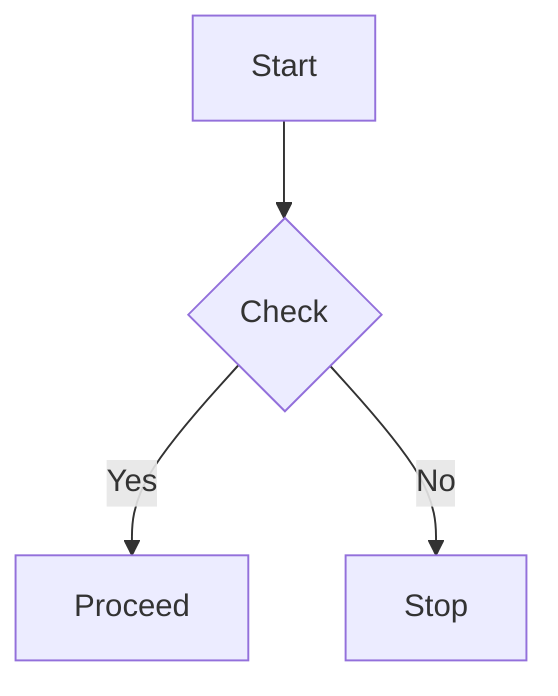

# DocHub

Next.js 16 + Fumadocs documentation hub with Mermaid diagrams, OG images, and LLM text export.

## Quickstart

- Prerequisite: Node.js >= 18.18.
- Install deps (postinstall will generate the content index via fumadocs-mdx):

```bash
npm install
npm run dev
```

Visit http://localhost:3000.

## Scripts

- dev: next dev
- build: next build
- start: next start
- lint: eslint

## Project structure

- [content/docs](content/docs): MDX docs content.
- [source.config.ts](source.config.ts:11): collections and schemas via [docs](source.config.ts:11) and [defineConfig()](source.config.ts:24).
- [src/lib/source.ts](src/lib/source.ts): content source [loader()](src/lib/source.ts:6), helpers [getPageImage()](src/lib/source.ts:12), [getLLMText()](src/lib/source.ts:21).
- [src/app/docs/[[...slug]]/page.tsx](src/app/docs/[[...slug]]/page.tsx): docs page renderer [Page()](src/app/docs/[[...slug]]/page.tsx:9), [generateStaticParams()](src/app/docs/[[...slug]]/page.tsx:32), [generateMetadata()](src/app/docs/[[...slug]]/page.tsx:36).
- [src/app/og/docs/[...slug]/route.tsx](src/app/og/docs/[...slug]/route.tsx): dynamic OG image [GET()](src/app/og/docs/[...slug]/route.tsx:8).
- [src/app/llms-full.txt/route.ts](src/app/llms-full.txt/route.ts): concatenated docs for LLMs [GET()](src/app/llms-full.txt/route.ts:5).
- [src/mdx-components.tsx](src/mdx-components.tsx): MDX components mapping [getMDXComponents()](src/mdx-components.tsx:6).
- [src/lib/layout.shared.tsx](src/lib/layout.shared.tsx): shared UI options [baseOptions()](src/lib/layout.shared.tsx:4).
- [src/app/(home)/page.tsx](src/app/(home)/page.tsx): landing page [HomePage()](src/app/(home)/page.tsx:48).
- [src/components/mermaid.tsx](src/components/mermaid.tsx): Mermaid renderer.

## Authoring MDX

- Files live under [content/docs](content/docs). Frontmatter follows the schema in [source.config.ts](source.config.ts:11). Processed markdown is available to code via [getLLMText()](src/lib/source.ts:21).
- Mermaid diagrams work via both the remark plugin in [defineConfig()](source.config.ts:24) and the [Mermaid](src/components/mermaid.tsx) component. Example:



## Routes and endpoints

- Docs UI: /docs (base URL set in [loader()](src/lib/source.ts:6)).
- OG images: /og/docs/... generated by [GET()](src/app/og/docs/[...slug]/route.tsx:8).
- LLM export: /llms-full.txt served by [GET()](src/app/llms-full.txt/route.ts:5).

## Customization

- Site name for OG: edit "site" in [GET()](src/app/og/docs/[...slug]/route.tsx:18).
- Navbar title/icon: adjust [baseOptions()](src/lib/layout.shared.tsx:4).

## Build and deploy

```bash
npm run build
npm run start
```

## Acknowledgements

Built with Fumadocs and Next.js.
